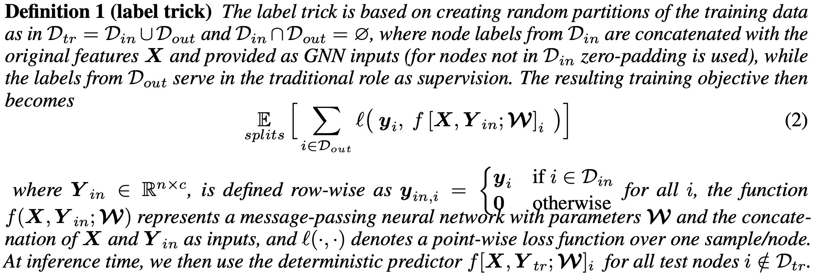

# Label Tricks of Node Classifcation on Graphs
<p align="center">
  
  <br />
  <br />
</p>

This is a `pytorch` implementation of GraphHINGE model. This is the experiment code in the following work:

> Why Propagate Alone? Parallel Use of Labels and Features on Graphs</br>
Yangkun Wang, Jiarui Jin, Weinan Zhang, Yongyi Yang, Jiuhai Chen, Quan Gan, Yong Yu, Zheng Zhang, Zengfeng Huang, David Wipf
[ICLR 2022](https://openreview.net/forum?id=VTNjxbFRKly)

### Prerequisites
- Python 3.6
- Pytorch 1.8.0
- DGL 0.6.0

### References
If you find this work helpful in your research, please consider citing the following paper. The bibtex are listed below:
```bibtex
@article{wang2021propagate,
  title={Why Propagate Alone? Parallel Use of Labels and Features on Graphs},
  author={Wang, Yangkun and Jin, Jiarui and Zhang, Weinan and Yang, Yongyi and Chen, Jiuhai and Gan, Quan and Yu, Yong and Zhang, Zheng and Huang, Zengfeng and Wipf, David},
  journal={ICLR},
  year={2022}
}
```